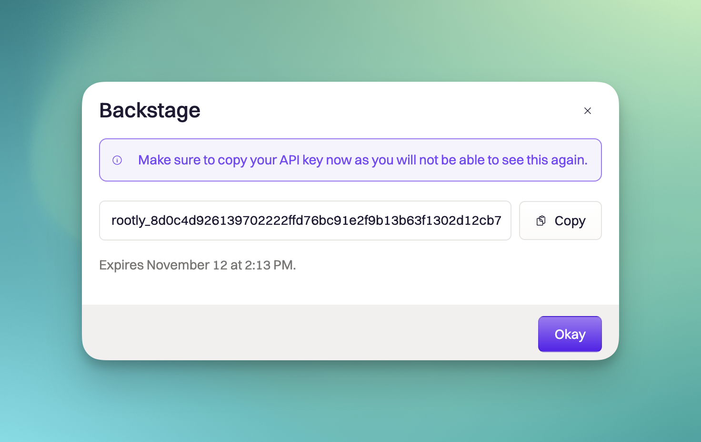
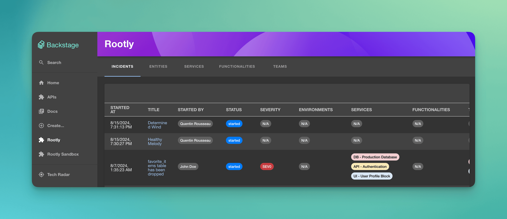
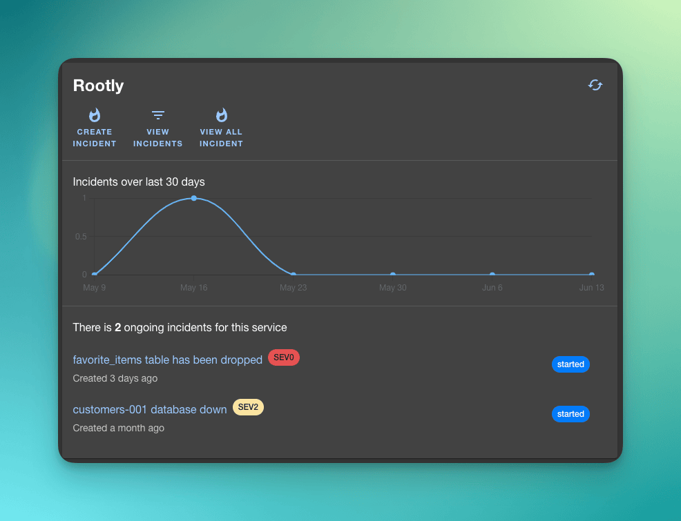
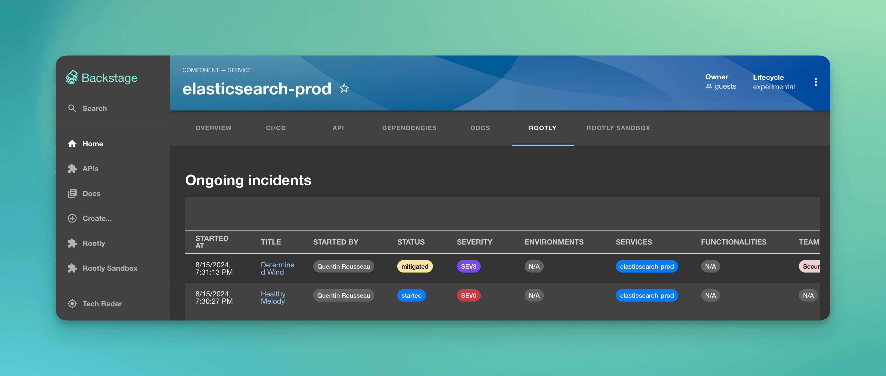

# Rootly plugin for Backstage

[](https://badge.fury.io/js/@rootly%2Fbackstage-plugin)
[](https://opensource.org/licenses/MIT)

The Rootly plugin is a frontend plugin that displays Rootly services, incidents in Backstage. The plugin includes three components that can be integrated into Backstage:

- The `RootlyPage` routable extension component which produces a standalone page with the following capabilities:

  - View and search a list of entities
  - View and search a list of services
  - View and search a list of functionalities
  - View and search a list of teams
  - View and search a list of incidents

- The `RootlyOverviewCard` component which produces a summary of your entity with incidents over last 30 days and ongoing incidents.

- The `RootlyIncidentsPage` component which produces a dedicated page within your entity with details about ongoing and past incidents.

You can link and import entities in rootly services through Backstage Web UI or through annotations.

## Installation

### Creating an Rootly API key

Because of the features provided by the plugin, an API key with full access to your Rootly domain is required.

- Read access on services is needed to list services, write access to link entities to services.
- Read access on functionalities is needed to list functionalities, write access to link entities to functionalities.
- Read access on incidents needed to list incidents.

1. Go to `Profile` -> `Manage API Keys`.

2. Click on `Generate New API Key` button.

3. Copy the key.

   

### Backstage Setup

Add the plugin to your frontend app:

```bash
yarn add --cwd packages/app @rootly/backstage-plugin
```

Add the plugin to your backend app:

```bash
yarn add --cwd packages/backend @rootly/backstage-plugin-entity-processor
```

Configure the plugin in `app-config.yaml`. The proxy endpoint described below will allow the frontend
to authenticate with Rootly without exposing your API key to users.

```yaml
# app-config.yaml

# Rootly single-organization configuration example
rootly:
  rootly-main: # You can change this
    apiKey: Bearer ${ROOTLY_API_KEY_MAIN}

# Rootly multi-organizations example
rootly:
  rootly-main: # You can change this
    isDefault: true
    apiKey: Bearer ${ROOTLY_API_KEY_MAIN}
  rootly-sandbox: # You can change this
    apiKey: Bearer ${ROOTLY_API_KEY_SANDBOX}

...

proxy:
  '/rootly/api':
    target: https://api.rootly.com
    changeOrigin: true
    credentials: forward
```

### Annotations

Available annotations are the following:

```yaml
rootly.com/organization-id: rootly # Optional if you use Rootly multi organizations.
rootly.com/service-id: 7a328a08-6701-445e-a1ad-ca2fb913ed1e # Use service-id or service-slug. Not both.
rootly.com/service-slug: elasticsearch-staging # Use service-id or service-slug. Not both.
rootly.com/service-auto-import: enabled # This will auto import the entity as a rootly service if we don't find any.
rootly.com/functionality-id: 7a328a08-694f4e1b-abbc-4cf7-bba0-a403df30ed88 # Use functionality-id or functionality-slug. Not both.
rootly.com/functionality-slug: login # Use functionality-id or functionality-slug. Not both.
rootly.com/functionality-auto-import: enabled # This will auto import the entity as a rootly functionality if we don't find any.
rootly.com/team-id: 39e77dcc-e056-4849-9dda-a362b2413e5c # Use team-id or team-slug. Not both.
rootly.com/team-slug: infrastucture # Use team-id or team-slug. Not both.
rootly.com/team-auto-import: enabled # This will auto import the entity as a rootly team if we don't find any.
```

#### Example

```yaml
apiVersion: backstage.io/v1alpha1
kind: Component
metadata:
  name: elasticsearch-staging
  description: |
    elasticsearch-staging
  annotations:
    github.com/project-slug: backstage/backstage
    backstage.io/techdocs-ref: dir:.
    lighthouse.com/website-url: https://rootly.com
    rootly.com/service-slug: elasticsearch-staging
    pagerduty.com/service-id: <sample-service-service-id>
spec:
  type: grpc
  owner: guests
  lifecycle: experimental
```

### Global

#### `RootlyPage` component



Expose the Rootly global page:

```jsx
// packages/app/src/App.tsx
import { RootlyPage } from '@rootly/backstage-plugin';

// ...
const AppRoutes = () => (
  <FlatRoutes>
    // ...
    <Route path="/rootly" element={<RootlyPage />} />
    //{' '}
    <Route
      path="/rootly-sandbox"
      element={<RootlyPage organizationId="rootly-sandbox" />}
    />
    // ...
  </FlatRoutes>
);
```

Add a link to the sidebar:

```jsx
// packages/app/src/components/Root/Root.tsx
import ExtensionIcon from '@material-ui/icons/ExtensionIcon';

export const Root = ({ children }: PropsWithChildren<{}>) => (
  <SidebarPage>
    <Sidebar>
      // ...
      <SidebarItem icon={ExtensionIcon} to="rootly" text="Rootly" />
      // <SidebarItem icon={ExtensionIcon} to="rootly-sandbox" text="Rootly Sandbox" />
      // ...
    </Sidebar>
  </SidebarPage>
);
```

### Entity

#### `RootlyOverviewCard` component



```jsx
// packages/app/src/components/catalog/EntityPage.tsx
import {
  RootlyOverviewCard,
  isRootlyAvailable,
} from '@rootly/backstage-plugin';

// For a service
const overviewContent = (
  <Grid container spacing={3} alignItems="stretch">
    // ...
    <EntitySwitch>
      <EntitySwitch.Case if={isRootlyAvailable}>
        <Grid item sm={6}>
          <RootlyOverviewCard />
        </Grid>
      </EntitySwitch.Case>
    </EntitySwitch>
    // ...
  </Grid>
);
```

#### `RootlyIncidentsPage` component



```jsx
// packages/app/src/components/catalog/EntityPage.tsx
import { RootlyIncidentsPage } from '@rootly/backstage-plugin';

// ...
const websiteEntityPage = (
  <EntityLayout>
    <EntityLayout.Route path="/" title="Overview">
      {overviewContent}
    </EntityLayout.Route>

    // ...

    <EntityLayout.Route path="/docs" title="Docs">
      <EntityTechdocsContent />
    </EntityLayout.Route>

    <EntityLayout.Route path="/rootly" title="Rootly">
      <EntitySwitch.Case if={isRootlyAvailable}>
        <Grid item sm={6}>
          <RootlyIncidentsPage />
        </Grid>
        // Rootly Multi Organization
        // <Grid item sm={6}>
        //   <RootlyIncidentsPage organizationId="rootly-sandbox" />
        // </Grid>
      </EntitySwitch.Case>
    </EntityLayout.Route>
  </EntityLayout>
);

// ...
const serviceEntityPage = (
  <EntityLayout>
    <EntityLayout.Route path="/" title="Overview">
      {overviewContent}
    </EntityLayout.Route>

    // ...

    <EntityLayout.Route path="/docs" title="Docs">
      <EntityTechdocsContent />
    </EntityLayout.Route>

    <EntityLayout.Route path="/rootly" title="Rootly">
      <RootlyIncidentsPage />
      // Rootly Multi Organization
      // <Grid item sm={6}>
      //   <RootlyIncidentsPage organizationId="rootly-sandbox" />
    </EntityLayout.Route>
  </EntityLayout>
);
```

## Configuring the Entity Processor

You can enable the entity processor in your Backstage instance by injecting the dependency in the backend system in `packages/backend/index.ts`.

```jsx
// packages/backend/index.ts
import { createBackend } from '@backstage/backend-defaults';

const backend = createBackend();

...

backend.add(import('@rootly/backstage-plugin-entity-processor'));

backend.start();
```

## License

This library is under the [MIT](LICENSE) license.
