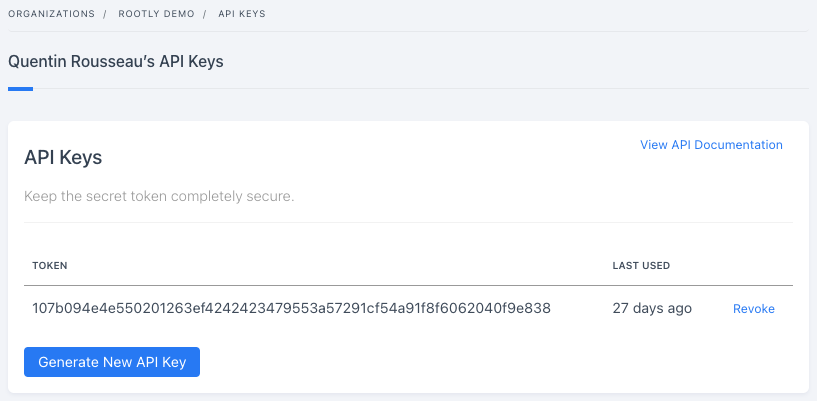
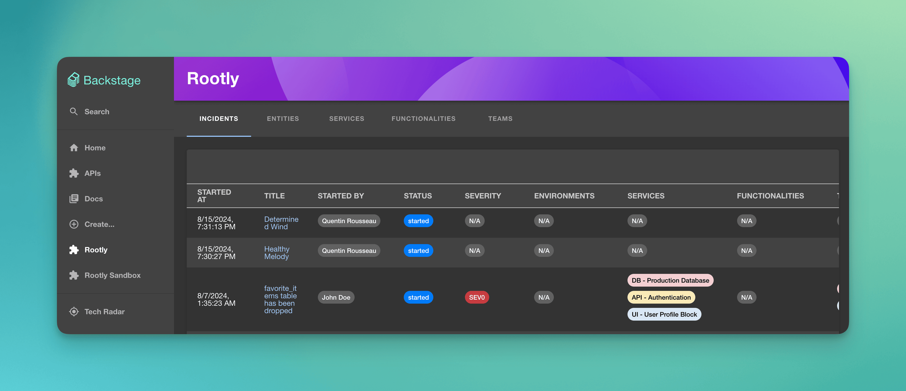
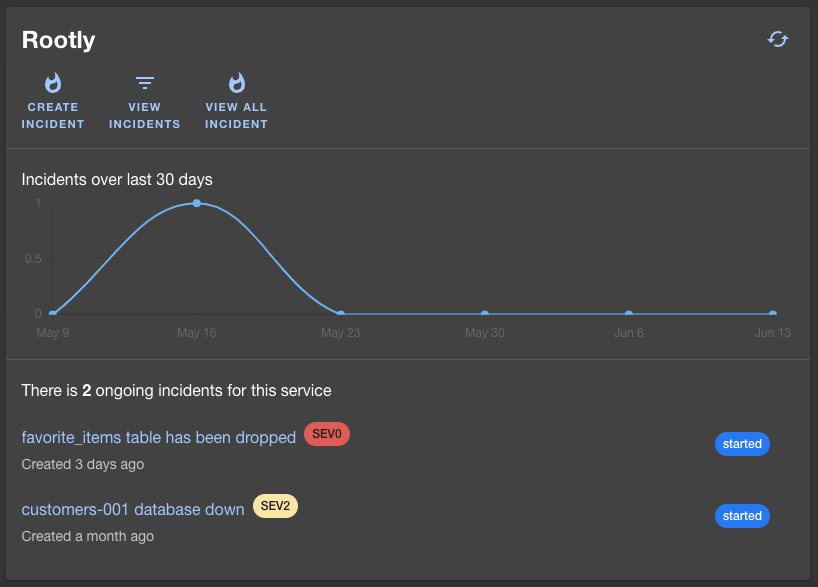
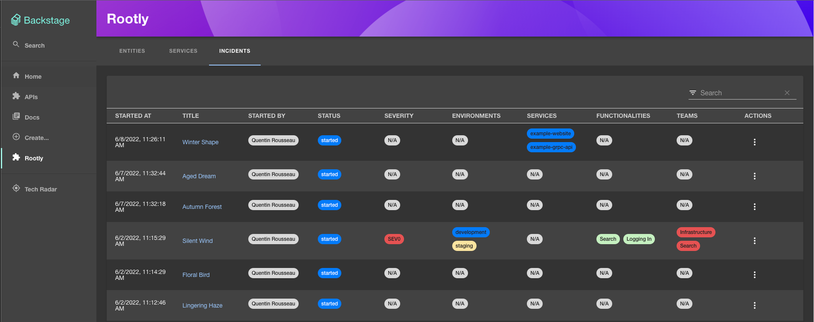
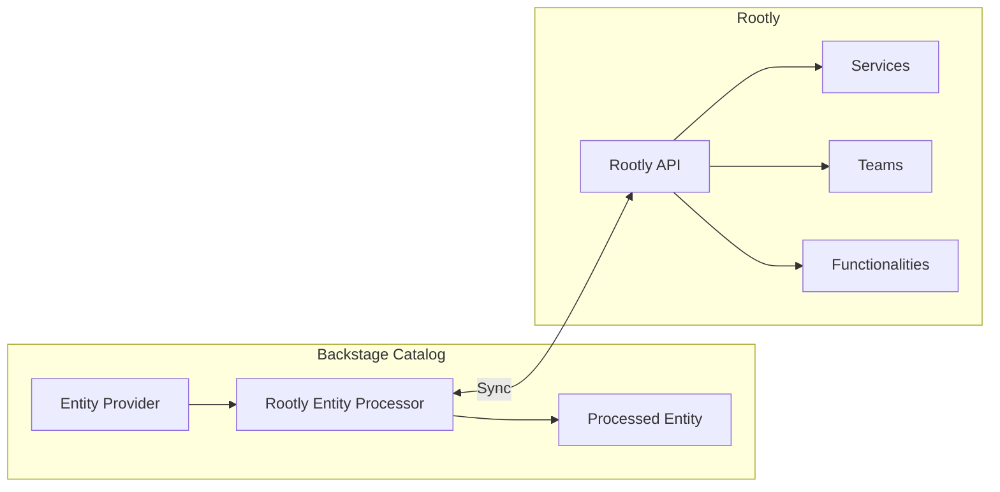

# Rootly plugin for Backstage

[](https://badge.fury.io/js/@rootly%2Fbackstage-plugin)
[](https://opensource.org/licenses/MIT)

The Rootly plugin is a frontend plugin that displays Rootly services, incidents in Backstage. The plugin includes three components that can be integrated into Backstage:

- The `RootlyPage` routable extension component which produces a standalone page with the following capabilities:

  - View and search a list of entities
  - View and search a list of services
  - View and search a list of functionalities
  - View and search a list of teams
  - View and search a list of incidents

- The `RootlyOverviewCard` component which produces a summary of your entity with incidents over last 30 days and ongoing incidents.

- The `RootlyIncidentsPage` component which produces a dedicated page within your entity with details about ongoing and past incidents.

You can link and import entities in rootly services through Backstage Web UI or through annotations.

## Installation

### Creating an Rootly API key

Because of the features provided by the plugin, an API key with full access to your Rootly domain is required.

- Read access on services is needed to list services, write access to link entities to services.
- Read access on functionalities is needed to list functionalities, write access to link entities to functionalities.
- Read access on incidents needed to list incidents.

1. Go to `Profile` -> `Manage API Keys`.

2. Click on `Generate New API Key` button.

3. Copy the key.

   

### Backstage Setup

Add the plugin to your frontend app:

```bash
yarn add --cwd packages/app @rootly/backstage-plugin
```

Add the plugin to your backend app:

```bash
yarn add --cwd packages/backend @rootly/backstage-plugin-entity-processor
```

Configure the plugin in `app-config.yaml`. The proxy endpoint described below will allow the frontend
to authenticate with Rootly without exposing your API key to users.

```yaml
# app-config.yaml

# Rootly single-organization configuration example
rootly:
  rootly-main:
    proxyPath: /rootly/api

# Rootly multi-organizations example
rootly:
  rootly-main:
    isDefault: true
    proxyPath: /rootly/api
  rootly-sandbox:
    proxyPath: /rootly-sandbox/api

...

proxy:
  endpoints:
    '/rootly/api':
      target: 'https://api.rootly.com'
      headers:
        Authorization: Bearer ${ROOTLY_MAIN_TOKEN}
    '/rootly-sandbox/api':
      target: 'https://api.rootly.com'
      headers:
        Authorization: Bearer ${ROOTLY_SANDBOX_TOKEN}
```

### Annotations

Available annotations are the following:

```yaml
rootly.com/organization-id: rootly # Optional if you use Rootly multi organizations.
rootly.com/service-id: 7a328a08-6701-445e-a1ad-ca2fb913ed1e # Use service-id or service-slug. Not both.
rootly.com/service-name: ElastiSearch Staging
rootly.com/service-slug: elasticsearch-staging # Use service-id or service-slug. Not both.
rootly.com/service-auto-import: enabled # This will auto import the entity as a rootly service if we don't find any.
rootly.com/functionality-id: 7a328a08-694f4e1b-abbc-4cf7-bba0-a403df30ed88 # Use functionality-id or functionality-slug. Not both.
rootly.com/functionality-name: Login
rootly.com/functionality-slug: login # Use functionality-id or functionality-slug. Not both.
rootly.com/functionality-auto-import: enabled # This will auto import the entity as a rootly functionality if we don't find any.
rootly.com/team-id: 39e77dcc-e056-4849-9dda-a362b2413e5c # Use team-id or team-slug. Not both.
rootly.com/team-slug: infrastucture # Use team-id or team-slug. Not both.
rootly.com/team-name: Infrastucture
rootly.com/team-auto-import: enabled # This will auto import the entity as a rootly team if we don't find any.
```

#### Example

```yaml
apiVersion: backstage.io/v1alpha1
kind: Component
metadata:
  name: elasticsearch-staging
  description: |
    elasticsearch-staging
  annotations:
    github.com/project-slug: backstage/backstage
    backstage.io/techdocs-ref: dir:.
    lighthouse.com/website-url: https://rootly.com
    rootly.com/service-slug: elasticsearch-staging
    pagerduty.com/service-id: <sample-service-service-id>
spec:
  type: grpc
  owner: guests
  lifecycle: experimental
```

### Global

#### `RootlyPage` component



Expose the Rootly global page:

```jsx
// packages/app/src/App.tsx
import { RootlyPage } from '@rootly/backstage-plugin';

// ...
const AppRoutes = () => (
  <FlatRoutes>
    // ...
    <Route path="/rootly" element={<RootlyPage />} />
    //{' '}
    <Route
      path="/rootly-sandbox"
      element={<RootlyPage organizationId="rootly-sandbox" />}
    />
    // ...
  </FlatRoutes>
);
```

Add a link to the sidebar:

```jsx
// packages/app/src/components/Root/Root.tsx
import ExtensionIcon from '@material-ui/icons/ExtensionIcon';

export const Root = ({ children }: PropsWithChildren<{}>) => (
  <SidebarPage>
    <Sidebar>
      // ...
      <SidebarItem icon={ExtensionIcon} to="rootly" text="Rootly" />
      // <SidebarItem icon={ExtensionIcon} to="rootly-sandbox" text="Rootly Sandbox" />
      // ...
    </Sidebar>
  </SidebarPage>
);
```

### Entity

#### `RootlyOverviewCard` component



```jsx
// packages/app/src/components/catalog/EntityPage.tsx
import {
  RootlyOverviewCard,
  isRootlyAvailable,
} from '@rootly/backstage-plugin';

// For a service
const overviewContent = (
  <Grid container spacing={3} alignItems="stretch">
    // ...
    <EntitySwitch>
      <EntitySwitch.Case if={isRootlyAvailable}>
        <Grid item sm={6}>
          <RootlyOverviewCard />
        </Grid>
      </EntitySwitch.Case>
    </EntitySwitch>
    // ...
  </Grid>
);
```

#### `RootlyIncidentsPage` component



```jsx
// packages/app/src/components/catalog/EntityPage.tsx
import { RootlyIncidentsPage } from '@rootly/backstage-plugin';

// ...
const websiteEntityPage = (
  <EntityLayout>
    <EntityLayout.Route path="/" title="Overview">
      {overviewContent}
    </EntityLayout.Route>

    // ...

    <EntityLayout.Route path="/docs" title="Docs">
      <EntityTechdocsContent />
    </EntityLayout.Route>

    <EntityLayout.Route path="/rootly" title="Rootly">
      <EntitySwitch.Case if={isRootlyAvailable}>
        <Grid item sm={6}>
          <RootlyIncidentsPage />
        </Grid>
        // Rootly Multi Organization
        // <Grid item sm={6}>
        //   <RootlyIncidentsPage organizationId="rootly-sandbox" />
        // </Grid>
      </EntitySwitch.Case>
    </EntityLayout.Route>
  </EntityLayout>
);

// ...
const serviceEntityPage = (
  <EntityLayout>
    <EntityLayout.Route path="/" title="Overview">
      {overviewContent}
    </EntityLayout.Route>

    // ...

    <EntityLayout.Route path="/docs" title="Docs">
      <EntityTechdocsContent />
    </EntityLayout.Route>

    <EntityLayout.Route path="/rootly" title="Rootly">
      <RootlyIncidentsPage />
      // Rootly Multi Organization
      // <Grid item sm={6}>
      //   <RootlyIncidentsPage organizationId="rootly-sandbox" />
    </EntityLayout.Route>
  </EntityLayout>
);

//...
const systemPage = (
  <EntityLayout>
    <EntityLayout.Route path="/" title="Overview">
      <>
        {overviewContent}
        <Grid container spacing={3} alignItems="stretch">
          {entityWarningContent}
          <Grid item md={6}>
            <EntityAboutCard variant="gridItem" />
          </Grid>
          <Grid item md={6} xs={12}>
            <EntityCatalogGraphCard variant="gridItem" height={400} />
          </Grid>
          <Grid item md={6}>
            <EntityHasComponentsCard variant="gridItem" />
          </Grid>
          <Grid item md={6}>
            <EntityHasApisCard variant="gridItem" />
          </Grid>
          <Grid item md={6}>
            <EntityHasResourcesCard variant="gridItem" />
          </Grid>
        </Grid>
      </>
    </EntityLayout.Route>
    
    // ...

    <EntityLayout.Route path="/rootly" title="Rootly">
      // Make sure to add rootly.com/organization-id annotation to all the components part of this system
      <RootlyIncidentsPage />
    </EntityLayout.Route>
  </EntityLayout>
);
```

## Entity Processor

The `@rootly/backstage-plugin-entity-processor` is a backend plugin that automatically synchronizes your Backstage catalog entities with Rootly. It's a required companion to the frontend plugin.

### Why Use the Entity Processor?

In Backstage's architecture, [entity processors](https://backstage.io/docs/features/software-catalog/external-integrations/) are middleware components that sit in the catalog's processing pipeline. They intercept entities as they flow through ingestion and can transform, validate, or enrich them.

The Rootly Entity Processor serves several purposes:

1. **Bidirectional Sync** - Automatically keeps Backstage entities and Rootly resources (services, functionalities, teams) in sync. When you annotate a Backstage entity with a Rootly service, the processor updates Rootly with the entity's `backstage_id`, creating a two-way link.

2. **Auto-Import** - When enabled via annotations (e.g., `rootly.com/service-auto-import: enabled`), the processor automatically creates corresponding resources in Rootly if they don't exist. This eliminates manual setup when onboarding new services.

3. **Annotation Management** - The processor enriches entities by adding resolved IDs back to annotations. For example, if you specify a `service-slug`, it will add the corresponding `service-id` after resolution.

4. **Multi-Organization Support** - Handles routing to different Rootly organizations based on the `rootly.com/organization-id` annotation.

### How It Works


```mermaid
flowchart LR
    subgraph Backstage Catalog
        A[Entity Provider] --> B[Rootly Entity Processor]
        B --> C[Processed Entity]
    end

    B <-->|Sync| D[Rootly API]

    subgraph Rootly
        D --> E[Services]
        D --> F[Teams]
        D --> G[Functionalities]
    end
```

The processor runs during Backstage's catalog refresh cycle (typically every few minutes). For each entity with Rootly annotations:

1. **Detection** - Checks if the entity has any Rootly annotations (`service-id`, `service-slug`, `functionality-id`, etc.)
2. **Resolution** - Looks up the referenced resource in Rootly via the API
3. **Sync** - Updates the Rootly resource with the Backstage entity reference (`backstage_id`)
4. **Auto-Import** - If the resource doesn't exist and auto-import is enabled, creates it in Rootly
5. **Annotation Update** - Adds resolved IDs back to the entity's annotations

### Installation

Add the plugin to your backend app:

```bash
yarn add --cwd packages/backend @rootly/backstage-plugin-entity-processor
```

Enable the entity processor in your Backstage backend:

```ts
// packages/backend/src/index.ts
import { createBackend } from '@backstage/backend-defaults';

const backend = createBackend();

// ... other plugins

backend.add(import('@rootly/backstage-plugin-entity-processor'));

backend.start();
```

### Configuration

The entity processor uses the same configuration as the frontend plugin. Ensure your `app-config.yaml` includes the Rootly proxy configuration:

```yaml
# app-config.yaml
rootly:
  rootly-main:
    proxyPath: /rootly/api

proxy:
  endpoints:
    '/rootly/api':
      target: 'https://api.rootly.com'
      headers:
        Authorization: Bearer ${ROOTLY_TOKEN}
```

### Supported Annotations

The processor responds to the following annotations:

| Annotation | Description | Auto-Import |
|------------|-------------|-------------|
| `rootly.com/service-id` | Link to a Rootly service by UUID | - |
| `rootly.com/service-slug` | Link to a Rootly service by slug | - |
| `rootly.com/service-auto-import` | Set to `enabled` to auto-create service | Yes |
| `rootly.com/functionality-id` | Link to a Rootly functionality by UUID | - |
| `rootly.com/functionality-slug` | Link to a Rootly functionality by slug | - |
| `rootly.com/functionality-auto-import` | Set to `enabled` to auto-create functionality | Yes |
| `rootly.com/team-id` | Link to a Rootly team by UUID | - |
| `rootly.com/team-slug` | Link to a Rootly team by slug | - |
| `rootly.com/team-auto-import` | Set to `enabled` to auto-create team | Yes |
| `rootly.com/organization-id` | Target Rootly organization (for multi-org setups) | - |

### Example: Auto-Import Service

```yaml
apiVersion: backstage.io/v1alpha1
kind: Component
metadata:
  name: payments-service
  annotations:
    rootly.com/service-slug: payments-service
    rootly.com/service-auto-import: enabled  # Creates service in Rootly if not found
spec:
  type: service
  owner: payments-team
  lifecycle: production
```

When this entity is processed:
- If `payments-service` exists in Rootly → links it to this Backstage entity
- If `payments-service` doesn't exist → creates it in Rootly and links it

## New Frontend System

Follow these steps to detect and configure the Rootly plugin if you'd like to use it in an application that supports the new Backstage frontend system.

### Package Detection

Once you install the `@rootly/backstage-plugin` package using your preferred package manager, you have to choose how the package should be detected by the app. The package can be automatically discovered when the feature discovery config is set, or it can be manually enabled via code (for more granular package customization cases).

<table>
  <tr>
    <td>Via config</td>
    <td>Via code</td>
  </tr>
  <tr>
    <td>
      <pre lang="yaml">
        <code>
# app-config.yaml
  app:
    # Enable package discovery for all plugins
    packages: 'all'
  ---
  app:
    # Enable package discovery only for Rootly
    packages:
      include:
        - '@rootly/backstage-plugin'
        </code>
      </pre>
    </td>
    <td>
      <pre lang="javascript">
       <code>
// packages/app/src/App.tsx
import { createApp } from '@backstage/frontend-defaults';
import rootlyPlugin from '@rootly/backstage-plugin/alpha';
//...
const app = createApp({
  // ...
  features: [
    //...
    rootlyPlugin,
  ],
});

//...
       </code>
      </pre>
    </td>
  </tr>
</table>

### Extensions Configuration

Currently, the plugin installs 5 extensions: 1 api, 1 page, 1 nav item (sidebar item), 1 entity page card and 1 entity page content (also known as entity page tab), see below examples of how to configure the available extensions. 

```yml
# app-config.yaml
app:
  extensions:
    # Example customizing the Rootly path
    - 'page:rootly':
        config:
          path: '/incidents'
    # Example removing the Rootly sidebar item
    - 'nav-item:rootly': false
    # Example changing the Rootly sidebar title
    - 'nav-item:rootly':
        config:
          title: 'Incidents'
    # Example disabling the Rootly entity card
    - 'entity-card:rootly': false
    # Example disabling the Rootly entity content
    - 'entity-content:rootly': false
    # Example customizing the Rootly entity content
    - 'entity-content:rootly':
        config:
          path: '/incidents'
          title: 'incidents'
```

## License

This library is under the [MIT](LICENSE) license.
